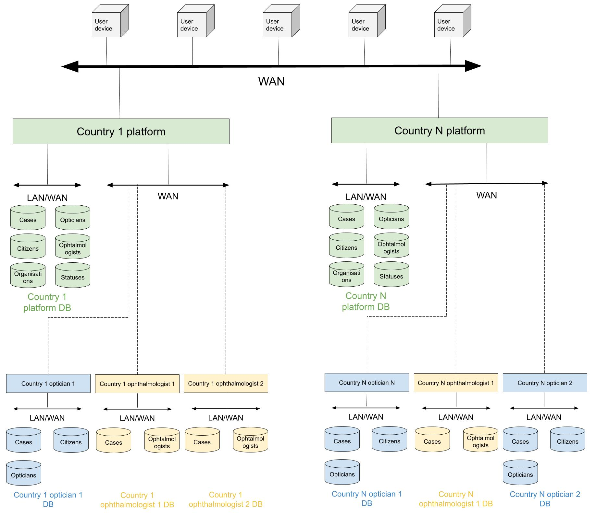

# What is the idea?

It is challenging for the aging population to keep the driving mobility and independence. By the EU regulations people over the age of 70 are required to pass eye-testing for the driving license renewal. The project team intends to develop a distributed platform which would support managing certification processes and will be distributed among all of the process participants which includes patients, opticians and ophthalmologists.

# What are the requirements?

The platform include the following functionality:

- registering patients, opticians and ophthalmologists;
- provide payment service for the eye-testing;
- upload of the patients’ retina images;
- storage of the medical information in accordance to DICOM standards of
- communication and data exchange;
- security and safe accessibility of private medical data;
- distributing certified test results between theophthalmologists, patients and driving license renewal authorities;
- storage of the patients’ medical information in records history;

# Communication network diagram
For safety reasons, every optician and ophtalmologist's organisation has it's own service and own database. Also, every country has it's own access point to the platform. 

The communication network diagram is the following:

